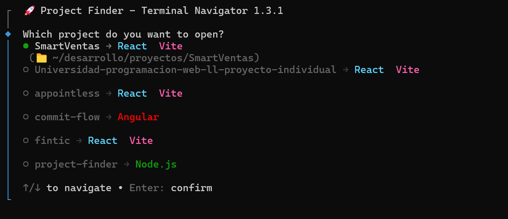

# 🚀 Project Finder CLI

**Project Finder** is an interactive terminal utility designed to streamline the developer workflow. It scans, identifies technology stacks, and enables instant navigation between projects in Linux/WSL2 environments.


---

## ✨ Features

- 🔍 **Intelligent Scanning:** Automatically detects valid projects (React, Vite, Java, Node.js).
- 🎨 **Rich UI:** High-fidelity visual branding with dynamic ANSI colors per technology.
- 📋 **One-Click Navigation:** Automatically copies the `cd` command to the system clipboard.
- 🐧 **WSL2/Ubuntu Optimized:** Built to integrate seamlessly with Linux development ecosystems.

## 🛠️ Built With

- **Node.js:** Core runtime.
- **@clack/prompts:** Modern, interactive terminal UI components.
- **clipboardy:** System-level clipboard management.

## 🚀 Installation & Usage

### 1. Clone the repository
```bash
  git clone [https://github.com/ErnestoIngles/project-finder.git](https://github.com/ErnestoIngles/project-finder.git)
  cd project-finder
```

### 2. Install dependencies and set up globally
```bash
  pnpm install
  pnpm install -g .
```

### 3. Run it!
Simply type the following from anywhere in your terminal:
```bash
  pf
```

## 📸 Screenshots



---

### 🏗️ Engineering Decisions
 * Directory Navigation Bypass: Since a child process cannot change the parent's working directory in Unix systems, a clipboard-based bridge was implemented to ensure instant navigation without complex shell configurations.

 * Dynamic Padding: The menu calculates the maximum string length of project names to maintain a perfect tabular layout regardless of folder naming conventions.

 * Persistence Roadmap: Future versions will include a config.json for customizable scan paths and ignore-lists.

 --- 
Created with ❤️ by [ErnestoIngles](https://github.com/ErnestoIngles)
